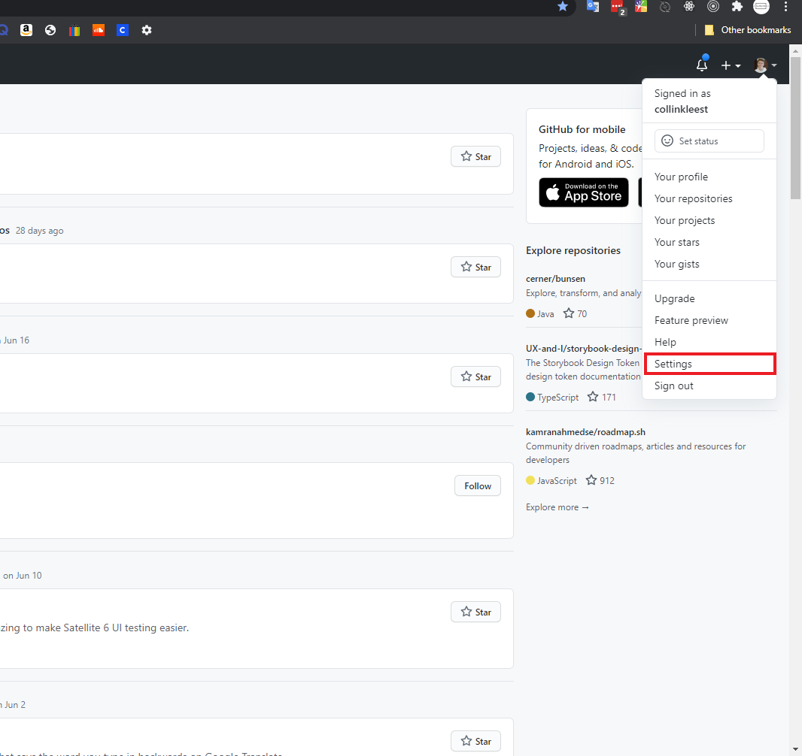
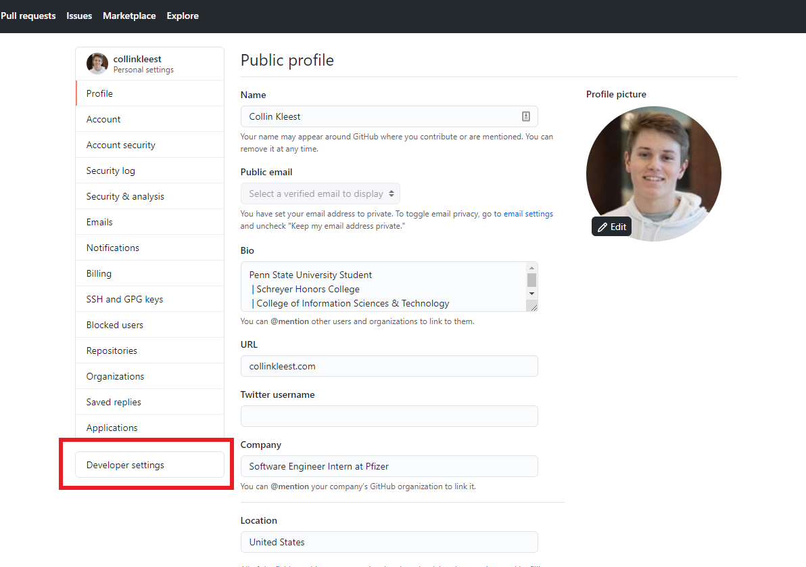
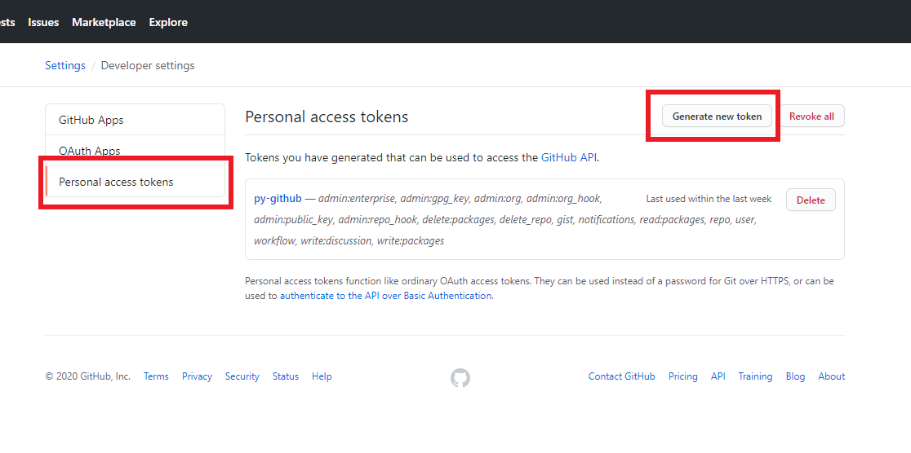
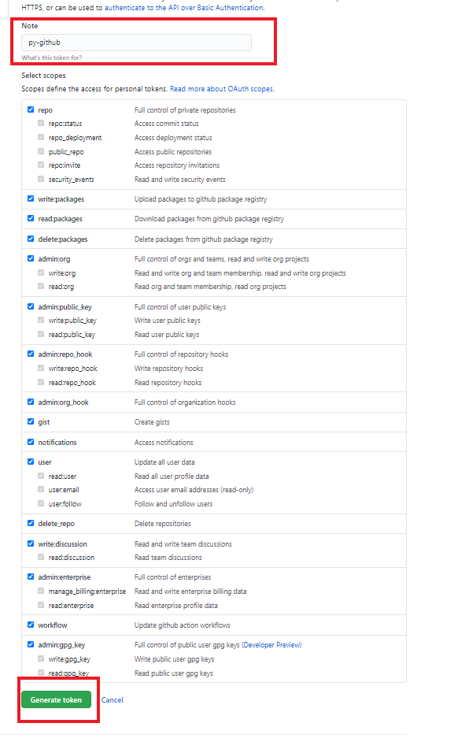
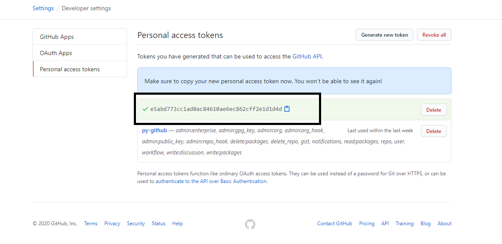

#### Steps to get api token (Required for usage)

Login to your github account, click on your users icon in the top right.
Proceed to click on settings.

On the left pannel click on Developer Settings.

Click on personal access tokens, and then generate new token.

Give the token a name, choose what you want to provide access to, and click generate token.

Make sure you copy your token and keep it in a safe place!

